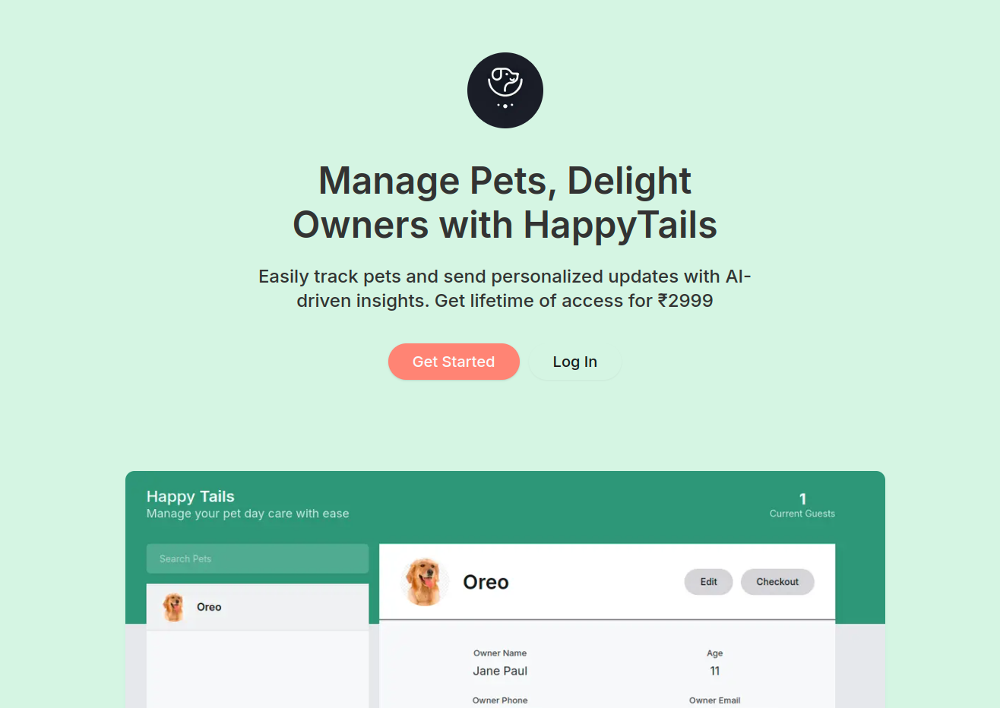
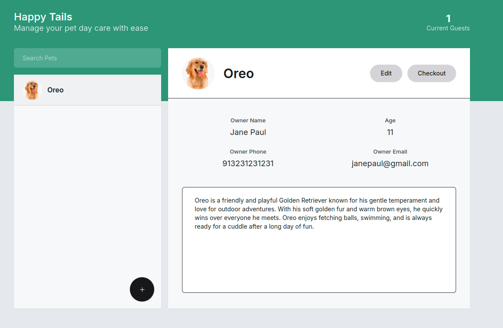
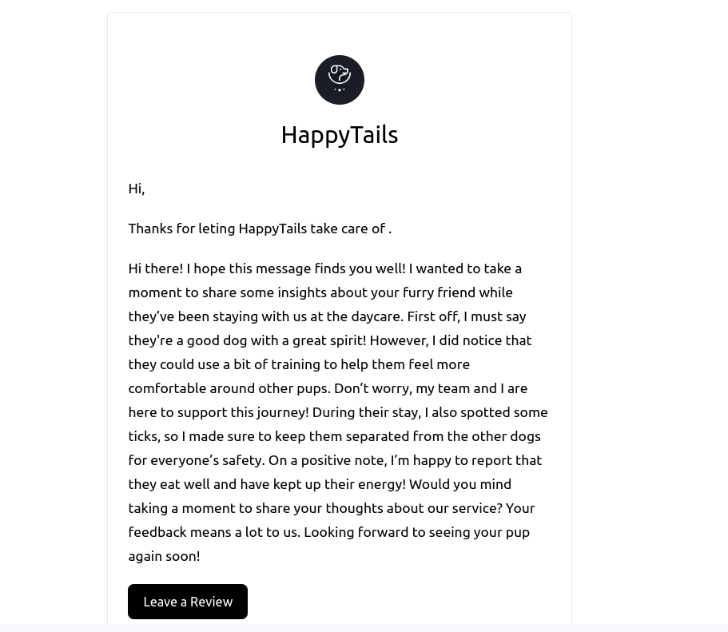

<h1 align="center">
  	  
</h1>

   
  
  

  <b>Manage your pets with ease</b> 

   <b>HappyTails</b> helps pet daycare owners <b>manage pets</b>, log details, and send personalized <b>AI-driven updates</b> to pet parents.
  <a href="https://happy-tails-one.vercel.app/">Visit Site</a>

  
  <b>Landing Page</b> 
  💥 Landing page with pricing and features 💥

  
  <b>Dashboard</b> 
  💥 Dashboard with search, pet list, add pet and stats. 💥

  
  <b>Personalize AI Thank You Emails</b> 
  💥 HappyTails uses AI to personalize thank you emails for pet parents. 💥

## How to run project

- Clone repo with `git clone https://github.com/manishsaraan/happytails.git`
- Install dependencies with `yarn install`
- Run project with `yarn start`

Visit: http://localhost:3000 to view the project
